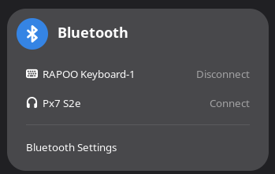
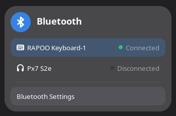

# Better Bluetooth Panel

A fully vibe-coded GNOME Shell extension that makes the Bluetooth quick settings panel show connected devices more clearly.


## Purpose
The default bluetooth panel uses action calls on the buttons - Press this button to Connect/Disconnect. Which IMO is misleading.

So I asked CLAUDE to change the label into Status label, add background color and a green dot as status indicator.

### Before:


### After:


## Requirements

- GNOME Shell 50

## Installation
### Extension manager 
Install via [Gnome extensions](https://extensions.gnome.org/extension/10689/better-bluetooth-panel/)

### Locally
1. Copy this directory to `~/.local/share/gnome-shell/extensions/betterbluetoothpanel@obbteam.github.io`
2. Restart GNOME Shell (log out/in on Wayland, or <kbd>Alt</kbd>+<kbd>F2</kbd> → `r` on X11)
3. Enable the extension:
   ```
   gnome-extensions enable betterbluetoothpanel@obbteam.github.io
   ```

## License

GPL-2.0-or-later
